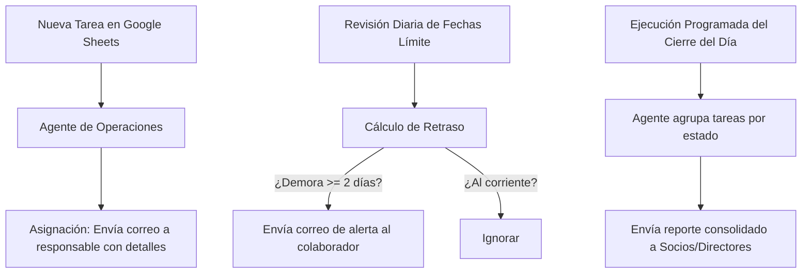

# Ecosistema de Automatización de Operaciones: El Agente Autónomo de Tareas y Seguimiento
**Por Alberto Farah Blair | Code Ur Life**

Perseguir a tu equipo para saber si avanzaron con sus tareas o si se cumplieron las fechas límite es uno de los mayores sumideros de tiempo en cualquier agencia o empresa de servicios. 

Este documento contiene el **blueprint completo, el modelo de datos, el código funcional y las instrucciones de IA** para construir un Agente de Operaciones que automatiza el flujo de asignación, calcula retrasos, envía correos de alerta a los colaboradores y despacha reportes de control diarios a la gerencia.

---

## 1. Arquitectura del Sistema

El agente actúa como un puente inteligente entre tu base de datos central (Google Sheets) y tu canal de comunicación (Gmail API), operando bajo la siguiente lógica:



---

## 2. El Modelo de Datos (Google Sheets)

Para que el agente funcione, necesitas una hoja de cálculo con dos pestañas estructuradas exactamente de esta forma:

### Pestaña: `EQUIPO`
Esta pestaña le sirve al agente para traducir nombres en correos electrónicos.
| Columna A | Columna B | Columna C |
| :--- | :--- | :--- |
| **Nombre** | **Rol** | **Correo** |
| Alberto | Director | alberto@agencia.com |
| Junior | Programador | junior@agencia.com |
| QA | QA Specialist | qa@agencia.com |

### Pestaña: `TAREAS_OPS`
El registro central donde se administran y monitorean todos los entregables.
| Columna A (ID) | Columna B (Fecha) | Columna C (Cliente) | Columna D (Tipo) | Columna E (Tarea) | Columna F (Responsable) | Columna G (Prioridad) | Columna H (Estado) | Columna I (Fecha Límite) | Columna J (Enlace) | Columna K (Notas) |
| :--- | :--- | :--- | :--- | :--- | :--- | :--- | :--- | :--- | :--- | :--- |
| 1 | 20/06/2026 | Cliente A | Desarrollo | Configurar API | Junior | Alta | Pendiente | 22/06/2026 | https://... | Evitar latencia |
| 2 | 20/06/2026 | Cliente B | Diseño | Armar Reels | Anabel | Media | Hecho | 24/06/2026 | https://... | Aprobado |

---

## 3. Código de la Solución (Script de Python Listo para Usar)

A continuación se presenta el script en Python simplificado y completamente comentado. Utiliza las librerías oficiales de Google (`google-api-python-client`) para gestionar los datos y la mensajería.

```python
import os
import datetime
from googleapiclient.discovery import build
from google.oauth2.credentials import Credentials

# CONFIGURACIÓN GENERAL
SPREADSHEET_ID = 'TU_SPREADSHEET_ID_AQUÍ'
EMAIL_MANAGER_1 = 'socio1@tuagencia.com'
EMAIL_MANAGER_2 = 'socio2@tuagencia.com'

# 1. Inicialización de Servicios de Google (OAuth2)
def get_google_services():
    # Asume que ya tienes el token.json generado en tu carpeta
    creds = Credentials.from_authorized_user_file('token.json', [
        'https://www.googleapis.com/auth/spreadsheets',
        'https://www.googleapis.com/auth/gmail.send'
    ])
    sheets_service = build('sheets', 'v4', credentials=creds)
    gmail_service = build('gmail', 'v1', credentials=creds)
    return sheets_service, gmail_service

# 2. Lógica para Enviar Correo mediante Gmail API
def send_email(gmail_service, to, subject, body):
    from email.mime.text import MIMEText
    import base64
    
    message = MIMEText(body)
    message['to'] = to
    message['subject'] = subject
    
    raw = base64.urlsafe_b64encode(message.as_bytes()).decode()
    try:
        gmail_service.users().messages().send(userId='me', body={'raw': raw}).execute()
        print(f"📧 Correo enviado con éxito a {to}")
        return True
    except Exception as e:
        print(f"❌ Error al enviar correo a {to}: {e}")
        return False

# 3. Procesar Alertas de Retraso de Tareas
def process_task_alerts(sheets_service, gmail_service):
    # Leer datos del equipo
    team_data = sheets_service.spreadsheets().values().get(
        spreadsheetId=SPREADSHEET_ID, range="'EQUIPO'!A2:C50"
    ).execute().get('values', [])
    
    team_emails = {row[0].strip().lower(): row[2].strip() for row in team_data if len(row) >= 3}
    
    # Leer tareas
    tasks_data = sheets_service.spreadsheets().values().get(
        spreadsheetId=SPREADSHEET_ID, range="'TAREAS_OPS'!A2:K2000"
    ).execute().get('values', [])
    
    today = datetime.date.today()
    
    for row in tasks_data:
        # Asegurar longitud de fila
        row = row + [''] * (11 - len(row))
        task_id, _, cliente, _, tarea_desc, responsable, _, estado, fecha_limite_str, _, _ = row
        
        if not task_id or estado.lower() in ('hecho', 'completado', 'anulado'):
            continue
            
        # Parsear fecha límite (formato esperado: dd/mm/aaaa)
        try:
            deadline = datetime.datetime.strptime(fecha_limite_str.strip(), '%d/%m/%Y').date()
        except ValueError:
            continue # Ignorar si la fecha no tiene el formato correcto
            
        # Calcular retraso
        delay_days = (today - deadline).days
        
        # Si tiene 2 o más días de retraso, notificar
        if delay_days >= 2:
            email_destinatario = team_emails.get(responsable.strip().lower())
            if email_destinatario:
                subject = f"⚠️ [Recordatorio de Tarea] Entrega retrasada - {cliente}"
                body = f"Hola {responsable},\n\n" \
                       f"Te escribimos de forma automática porque detectamos que la siguiente tarea presenta una demora de {delay_days} días:\n\n" \
                       f"📌 Tarea: {tarea_desc} (ID: {task_id})\n" \
                       f"🏷️ Cliente: {cliente}\n" \
                       f"📅 Fecha Límite: {fecha_limite_str}\n\n" \
                       f"Por favor, actualiza el estado en el sistema o infórmanos si requieres ayuda.\n\n" \
                       f"Saludos,\nOperations Hub"
                send_email(gmail_service, email_destinatario, subject, body)

# 4. Generar y Enviar Reporte Ejecutivo Diario
def send_daily_executive_report(sheets_service, gmail_service):
    tasks_data = sheets_service.spreadsheets().values().get(
        spreadsheetId=SPREADSHEET_ID, range="'TAREAS_OPS'!A2:K2000"
    ).execute().get('values', [])
    
    today = datetime.date.today()
    retrasadas = []
    activas = []
    
    for row in tasks_data:
        row = row + [''] * (11 - len(row))
        task_id, _, cliente, _, tarea_desc, responsable, prioridad, estado, fecha_limite_str, _, _ = row
        
        if not task_id:
            continue
            
        es_completada = estado.lower() in ('hecho', 'completado', 'anulado')
        
        task_info = {
            "cliente": cliente, "tarea": tarea_desc, "dueno": responsable, 
            "prioridad": prioridad, "estado": estado, "limite": fecha_limite_str
        }
        
        if es_completada:
            continue
            
        try:
            deadline = datetime.datetime.strptime(fecha_limite_str.strip(), '%d/%m/%Y').date()
            if (today - deadline).days >= 2:
                task_info["demora"] = (today - deadline).days
                retrasadas.append(task_info)
            else:
                activas.append(task_info)
        except ValueError:
            activas.append(task_info)
            
    # Redactar cuerpo del reporte
    report_body = f"📊 REPORTE DIARIO DE OPERACIONES - {today.strftime('%d/%m/%Y')}\n"
    report_body += "="*50 + "\n\n"
    
    report_body += f"⚠️ TAREAS CON RETRASO (2+ DÍAS): {len(retrasadas)}\n"
    report_body += "-"*40 + "\n"
    for t in retrasadas:
        report_body += f"- [{t['cliente']}] {t['tarea']} - Responsable: {t['dueno']} | Retraso: {t['demora']} días\n"
    report_body += "\n"
    
    report_body += f"📋 TAREAS EN CURSO: {len(activas)}\n"
    report_body += "-"*40 + "\n"
    for t in activas:
        report_body += f"- [{t['cliente']}] {t['tarea']} ({t['estado']}) - Responsable: {t['dueno']}\n"
        
    # Enviar reporte a gerencia
    for manager_email in [EMAIL_MANAGER_1, EMAIL_MANAGER_2]:
        send_email(
            gmail_service, manager_email, 
            f"📊 [Reporte Diario] Resumen Operativo - {today.strftime('%d/%m/%Y')}", 
            report_body
        )

# Ejecución principal
if __name__ == '__main__':
    sheets, gmail = get_google_services()
    print("🤖 Iniciando escaneo de alertas...")
    process_task_alerts(sheets, gmail)
    print("📈 Generando reporte diario para socios...")
    send_daily_executive_report(sheets, gmail)
    print("✅ Procesos finalizados con éxito.")
```

---

## 5. Instrucciones para tu Asistente de IA (Claude Code, Cursor o ChatGPT)

Si usas un asistente de código de IA, puedes entregarle este documento y pedirle que lo implemente por ti en un par de segundos. 

**Copia y pega el siguiente prompt en el chat de tu IA:**

> Actúa como un Ingeniero de Automatización Senior. Lee este documento completo e implementa el Agente de Operaciones en Python en este directorio local:
> 1. Instala las dependencias necesarias de Google Cloud (`google-api-python-client`, `google-auth-httplib2`, `google-auth-oauthlib`) en un entorno virtual.
> 2. Crea un archivo de configuración `config.json` para almacenar las credenciales de Sheets y correos electrónicos.
> 3. Escribe el script de Python estructurado e implementa las funciones de conexión, el escaneo de tareas retrasadas y el envío de reportes consolidando la información de las pestañas `EQUIPO` y `TAREAS_OPS` como se detalla en el modelo de datos.
> 4. Escribe un script de prueba `test_agent.py` que simule datos locales y el envío de correos mediante logs para verificar que toda la lógica de cálculo de retraso de tareas y agrupamiento de reportes funciona de forma impecable antes de conectar las APIs de producción de Google Cloud.

---

## 6. ¿Cómo Exportar este Documento a PDF?

Para entregar este archivo a tus prospectos en un formato profesional con tu marca:
1. Abre este archivo (`BLUEPRINT_DRIVE_AGENT.md`) en tu editor.
2. Expórtalo directamente a PDF usando tu lector Markdown o la opción de impresión de tu navegador (Guardar como PDF) aplicando un formato limpio y elegante.
