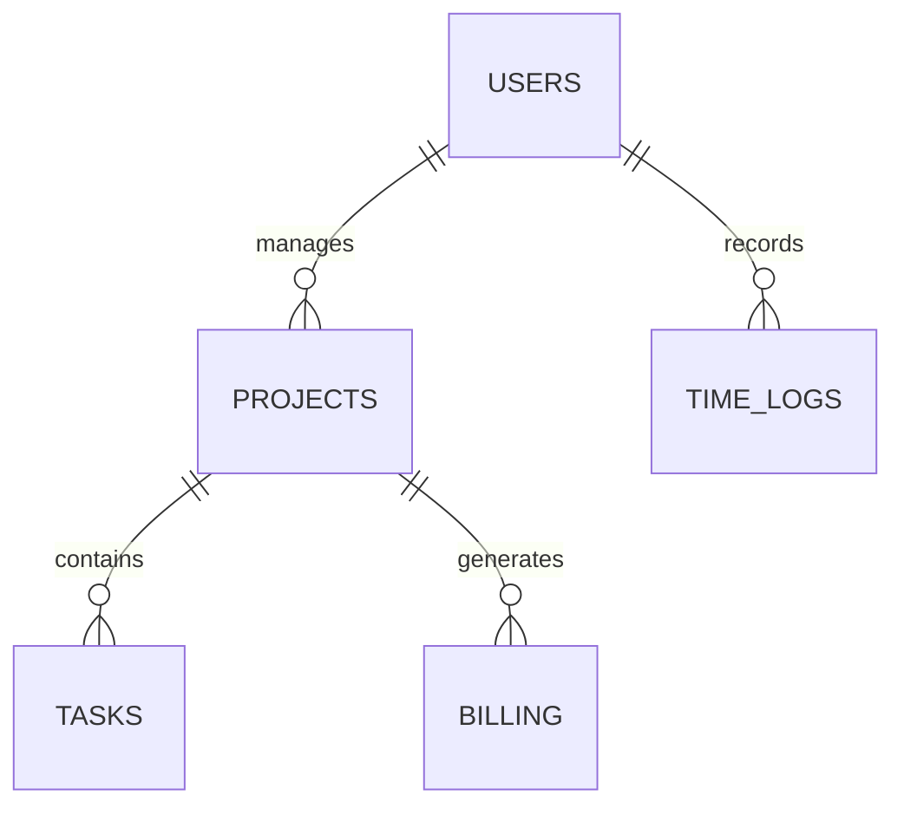

# Arquitectura del Portal y CMS en "miweb"
**Especificación de Base de Datos, Control de Roles y Flujo de Datos para Clientes y Trabajadores**
*Estructura de Negocio Localizada en Soles (PEN) para Alberto Farah Blair*

Este documento detalla la especificación técnica para estructurar el panel de control, la base de datos y la seguridad por roles de tu portal [miweb](file:///d:/Proyectos%20personales/MiWeb), permitiendo que funcione como tu sistema de ventas y centro de operaciones del negocio.

---

## 1. El Ecosistema de Roles y Permisos (Seguridad del Sistema)

Para evitar fugas de información y accesos indebidos, el CMS implementa una matriz de control de acceso basada en roles (RBAC):

```
                       [ Administrador (Alberto) ]
                                    |
            +-----------------------+-----------------------+
            |                                               |
  [ Trabajador (Junior/QA) ]                       [ Cliente Externo ]
  - Ver tareas asignadas                           - Ver su dashboard
  - Loguear horas trabajadas                       - Descargar facturas
  - Leer documentación técnica                    - Abrir tickets de soporte
```

### Rol 1: Administrador (Alberto)
*   **Permisos de Lectura/Escritura Totales:**
    *   Ver flujo de caja consolidado (ingresos, egresos, impuestos provisionados).
    *   Gestionar y asignar proyectos y tareas del WBS a colaboradores.
    *   Aprobar cotizaciones y registrar facturas/comprobantes de la SUNAT.
    *   Crear, modificar o suspender cuentas de trabajadores y clientes.
    *   Acceso al llavero de credenciales cifradas de clientes.

### Rol 2: Trabajador (Junior / QA)
*   **Permisos Limitados a la Operación:**
    *   Ver únicamente los proyectos y tareas WBS que tiene asignados.
    *   Registrar horas hombre dedicadas a cada tarea (control de capacidad).
    *   Acceder únicamente a las credenciales de clientes autorizadas expresamente por Alberto.
    *   *Bloqueo absoluto:* No pueden ver finanzas globales, tarifas de facturación de cara al cliente ni datos de otros proyectos.

### Rol 3: Cliente
*   **Permisos Limitados al Portal del Cliente:**
    *   Ver el avance porcentual del proyecto en base a los hitos del WBS.
    *   Aprobar entregables (hitos) y firmar digitalmente actas de conformidad.
    *   Descargar cotizaciones en PDF, contratos y facturas con detalle de detracciones.
    *   Cargar de forma segura accesos y archivos de proyecto.
    *   Crear tickets de soporte técnico para mantenimientos (RET.B/A).

---

## 2. Esquema de Base de Datos Propuesto (Tablas Relacionales)

Para estructurar esto en PostgreSQL o MySQL en `miweb`, implementamos las siguientes tablas:



### Tabla: `users` (Usuarios, Trabajadores y Clientes)
*   `id` (UUID, Primary Key)
*   `email` (VARCHAR, Unique)
*   `password_hash` (VARCHAR)
*   `role` (ENUM: 'admin', 'worker', 'client')
*   `name` (VARCHAR)
*   `ruc_dni` (VARCHAR, Nullable - para facturación local)
*   `created_at` (TIMESTAMP)

### Tabla: `projects` (Proyectos)
*   `id` (UUID, Primary Key)
*   `client_id` (UUID, Foreign Key -> `users.id`)
*   `name` (VARCHAR)
*   `description` (TEXT)
*   `status` (ENUM: 'propuesta', 'en_desarrollo', 'qa', 'finalizado', 'mantenimiento')
*   `pricing_model` (ENUM: 'pago_unico', 'mensual_retainer')
*   `currency` (VARCHAR, Default 'PEN')
*   `total_value` (DECIMAL)
*   `start_date` (DATE)
*   `end_date` (DATE)

### Tabla: `tasks` (WBS / Tareas del Proyecto)
*   `id` (UUID, Primary Key)
*   `project_id` (UUID, Foreign Key -> `projects.id`)
*   `assigned_to` (UUID, Foreign Key -> `users.id` - programador)
*   `title` (VARCHAR)
*   `description` (TEXT)
*   `estimated_hours` (INTEGER)
*   `status` (ENUM: 'todo', 'in_progress', 'qa', 'done')
*   `created_at` (TIMESTAMP)

### Tabla: `time_logs` (Registro de Horas de Colaboradores)
*   `id` (UUID, Primary Key)
*   `task_id` (UUID, Foreign Key -> `tasks.id`)
*   `user_id` (UUID, Foreign Key -> `users.id`)
*   `logged_hours` (DECIMAL)
*   `work_description` (TEXT)
*   `logged_at` (DATE)

### Tabla: `billing` (Facturación e Impuestos SUNAT)
*   `id` (UUID, Primary Key)
*   `project_id` (UUID, Foreign Key -> `projects.id`)
*   `invoice_number` (VARCHAR, Nullable - comprobante SUNAT)
*   `net_amount` (DECIMAL - valor venta)
*   `igv_amount` (DECIMAL - 18% o 0%)
*   `total_amount` (DECIMAL - total con IGV)
*   `is_subject_to_detraccion` (BOOLEAN)
*   `detraccion_amount` (DECIMAL)
*   `payment_status` (ENUM: 'pendiente', 'pagado', 'detraccion_pendiente')
*   `due_date` (DATE)

---

## 3. Flujo de Datos y Conexión de Datos Externos

1.  **Seguridad Criptográfica para Credenciales:** Las credenciales del cliente se guardan en un campo cifrado `client_credentials` en la base de datos mediante encriptación simétrica AES-256. La llave de desencriptación solo se carga en memoria en la sesión activa de Alberto (`Admin`).
2.  **API Rest de miweb:**
    *   `POST /api/leads` -> Registra prospectos desde la Landing Page.
    *   `GET /api/projects/:id/progress` -> Devuelve el porcentaje de avance calculado automáticamente en base a las tareas finalizadas (`status = 'done'`) en la tabla `tasks`.
    *   `POST /api/time-logs` -> Registra las horas trabajadas por el Junior y recalcula el costo MOD real devengado frente al presupuesto estimado.
