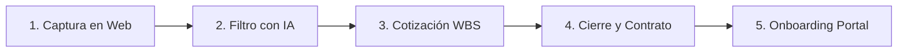

# Manual Operativo de Ventas y Onboarding de Clientes (SOP)
**Protocolos Comerciales, Emisión de Comprobantes, Detracciones y Bienvenida (Modelo RMT)**
*Estructura de Negocio Localizada en Soles (PEN) para Alberto Farah Blair*

Este documento establece el **Procedimiento Operativo Estándar (SOP)** para gestionar tus clientes desde el primer contacto comercial hasta el arranque técnico del proyecto, garantizando el cumplimiento fiscal ante la **SUNAT** (Régimen MYPE Tributario) y protegiendo tus márgenes contra fricciones financieras.

---

## 1. El Pipeline de Ventas (Embudo Comercial)

El embudo de ventas está diseñado para filtrar prospectos rápidamente y asegurar que solo cotices a clientes calificados con el presupuesto correcto.



### Etapa 1: Captura e Inteligencia Comercial (Lead Intake)
*   **Canal:** El cliente potencial llena el formulario en tu portafolio/portal [miweb](file:///d:/Proyectos%20personales/MiWeb) (o agenda vía Calendly).
*   **Filtro Inicial:** El formulario debe requerir obligatoriamente: *Presupuesto estimado, descripción del flujo actual, y herramientas utilizadas.*

### Etapa 2: Calificación de Lead (Silhouette Brain)
*   **Acción:** Un webhook en n8n envía los datos del lead a tu agente de IA (Silhouette Brain) para categorizarlo:
    *   **Público C (Pymes locales):** Sitios WordPress, migraciones simples. Rango: S/. 800 - S/. 6,000.
    *   **Público B (Startups/Agencias):** Integraciones complejas, apps React, CRM onboarding. Rango: S/. 13,000 - S/. 24,000.
    *   **Público A (Corporaciones/SaaS):** Swarms multi-agente LangGraph, SaaS Next.js a medida. Rango: S/. 31,000+.
*   **Criterio de Rechazo:** Leads que busquen desarrollos complejos con presupuestos menores a tu piso de seguridad (Precio Mínimo de Seguridad).

### Etapa 3: Cotización Dinámica (WBS en Excel)
*   **Acción:** Abres la pestaña `Calculadora WBS` de tu [Calculadora_de_Costos_y_Precios.xlsx](file:///d:/Proyectos%20personales/Mi%20perfil%20laboral/Calculadora_de_Costos_y_Precios.xlsx).
*   **Paso a Paso:**
    1.  Desglosas el proyecto en hasta 10 actividades reales.
    2.  Asignas a cada actividad el rol responsable (`Alberto`, `Junior`, `QA`).
    3.  Ajustas la ubicación del cliente (`PE` para local con 18% IGV, `INT` para extranjero con 0% IGV).
    4.  Seleccionas el canal de cobro (`TR` para Transferencia local, `PP` para PayPal con recargo).
    5.  El Excel arrojará de forma inmediata el **Precio Sugerido con Gross-Up** y el **Total Facturado Proforma**.
*   **Regla de Oro:** Nunca envíes una propuesta por debajo del *Precio Mínimo de Seguridad* arrojado por el Excel.

### Etapa 4: Negociación y Propuesta Comercial
*   **Formato de Propuesta:** Generas una propuesta formal en PDF basada en tu catálogo comercial [CATALOGO_PRECIOS_Y_PLANES_PEN.md](file:///d:/Proyectos%20personales/Mi%20perfil%20laboral/DOCUMENTACION_FINANCIERA_PEN/CATALOGO_PRECIOS_Y_PLANES_PEN.md).
*   **Elementos Obligatorios:**
    *   Entregables claros definidos por hitos de pago (ej. 50% Adelanto / 50% Entrega).
    *   Inclusión de las **4 Cláusulas de Blindaje** (API/Servidores a cargo del cliente, AI Disclaimer, IP de Silhouette OS, Límite de 2 revisiones por hito).

---

## 2. Protocolo de Cierre Contractual y Emisión Tributaria

Una vez aceptada la propuesta, iniciamos el protocolo legal y de facturación ante la SUNAT.

### Paso 1: Firma del Contrato
*   El contrato se genera automáticamente usando tu servicio [contract-generator-svc](file:///D:/Proyectos%20personales/contract-generator-svc) y se envía para firma digital (ej. via Docusign, HelloSign o firma criptográfica propia).

### Paso 2: Validación de RUC y Emisión de Factura (SUNAT RMT)
*   **Clientes en Perú (Servicio Local):**
    *   Solicitas ficha RUC del cliente y verificas que esté en estado "Activo" y "Habido".
    *   Emitas la **Factura Electrónica** adicionando obligatoriamente el **18% de IGV**.
    *   *Ejemplo:* Si el valor neto es S/. 5,000.00, la factura se emite por S/. 5,900.00 (S/. 900.00 de IGV).
*   **Clientes en el Extranjero (Exportación de Servicios):**
    *   Emitas la factura bajo la figura de **Exportación de Servicios Modernos** (Inafecto, 0% de IGV).
    *   *Importante:* El RUC de Alberto (RUC 10) debe estar registrado en el *Registro de Exportadores de Servicios* de la SUNAT.

### Paso 3: Retención de Detracción (12% SPOT) - Solo Clientes Perú
Si la factura emitida supera los **S/. 700.00 PEN (con IGV incluido)**, aplica la detracción obligatoria del **12%** bajo el código de servicio SUNAT **022 (Otros Servicios Empresariales)**:
1.  **Instrucción al cliente:** *"Esta factura está sujeta a la detracción del 12%. Por favor, deposite S/. [Monto Detracción] en mi cuenta del Banco de la Nación N° [Cuenta Detracciones] y la diferencia (88%) en mi cuenta corriente de Interbank/BCP."*
2.  **Validación:** El cliente debe enviarte la constancia de depósito de detracción de la SUNAT antes de que liberes los primeros accesos o entregables.

---

## 3. Protocolo de Onboarding de Cliente (Paso a Paso)

El onboarding garantiza que el cliente se sienta seguro y que el equipo (Alberto y Junior) tenga todo lo necesario para empezar a programar de inmediato.

```
[Cliente Acepta] -> [Pago de Adelanto] -> [Validación de Factura/Detracción] -> [Creación de Perfil en miweb] -> [Kickoff Meeting]
```

### Paso 1: Recepción de Fondos
*   Verificas el depósito del 50% de adelanto (neto disponible tras comisiones si fue internacional).

### Paso 2: Creación de Cuenta en el Portal "miweb"
*   El CMS de [miweb](file:///d:/Proyectos%20personales/MiWeb) crea automáticamente un perfil de **Cliente** y asocia el proyecto.
*   **Credenciales:** El sistema envía un correo de bienvenida automático al cliente con sus credenciales de acceso para su dashboard privado.

### Paso 3: Solicitud Segura de Accesos (Credenciales del Cliente)
*   **Protocolo de Seguridad:** Queda estrictamente prohibido que el cliente envíe contraseñas por WhatsApp o correo.
*   **Acción:** El cliente inicia sesión en su dashboard de `miweb` y completa el formulario cifrado de accesos a:
    *   Cuentas de Hosting / VPS (Hostinger, cPanel, Hetzner).
    *   Cuentas de dominio (GoDaddy, Namecheap, Punto.pe).
    *   Cuentas de APIs (OpenAI, Anthropic, Meta Developer).
*   *Nota:* Estos accesos se guardan cifrados y solo son visibles para Alberto (`Admin`) y habilitados selectivamente para el programador `Junior`.

### Paso 4: Reunión de Kickoff (Lanzamiento)
*   Una sesión en vivo de **15 a 30 minutos** para alinear expectativas:
    1.  Presentar al Junior responsable de la maquetación.
    2.  Confirmar las fechas del cronograma de hitos.
    3.  Establecer que el canal de comunicación oficial para entregables y tickets de soporte es el portal `miweb` (evitando chats informales de WhatsApp los fines de semana).

### Paso 5: Creación de Workspace en Jira/n8n Interno
*   Se crea de manera interna el tablero de tareas (WBS) en el portal, asignando subtareas específicas al programador Junior y los hitos de QA correspondientes.
