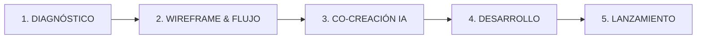

# 🚀 Blueprint del Sistema Comercial y Operativo: De Agencia Tradicional a Socio de Automatización e IA

Este documento detalla la estructura comercial y operativa de la agencia **AM Digital** (líder en desarrollo web y SEM en Arequipa) y la transforma en un sistema mejorado, escalable y automatizado para tu propia agencia (**Code Ur Life**), integrando tu ventaja competitiva: **Desarrollo Web + Inteligencia Artificial Aplicada + Automatización Low-Code (n8n/Make)**.

---

## 1. Posicionamiento Estratégico (El Diferencial Contra Agencias Tradicionales)

Las agencias tradicionales venden **"páginas web bonitas"**. Tú vendes **"Sistemas Digitales de Generación y Gestión de Clientes que operan 24/7 con IA"**.

| Característica | Agencia Web Tradicional (Ej: AM Digital) | Tu Ecosistema de Automatización & IA |
| :--- | :--- | :--- |
| **Enfoque de Venta** | "Visibilidad en internet", "Diseño responsive". | "Eliminación de tareas manuales", "Aumento de conversión de leads". |
| **Plataformas** | WordPress estándar, plantillas predefinidas. | Next.js / React + Tailwind CSS + APIs de IA + Base de datos vectorial (RAG). |
| **Valor Añadido** | Formulario de contacto que envía un correo estándar. | Enrutamiento inteligente de leads, bots que califican en WhatsApp, CRM sincronizado. |
| **Modelo de Ingresos** | Desarrollo One-Shot + Hosting anual simple (S/ 750). | Desarrollo Inicial + Fee mensual de optimización y soporte de flujos de IA (Retainer). |

---

## 2. Escalera de Ofertas: Planes y Precios (Mercado Local Perú vs. Internacional)

Estructura tus servicios en tres niveles claros. Esto te permite usar el **"efecto ancla"**: los clientes verán el plan Corporativo y el Profesional les parecerá sumamente accesible por el nivel de valor.

### A. Tarifas para el Mercado Local (Perú / Arequipa - PEN S/)

#### 💻 Plan 01: Web Esencial + Automatización Inicial
*   **Precio Sugerido:** S/ 2,800 (Pago único) + S/ 150/mes de mantenimiento (dominio/hosting básico).
*   **Target:** Negocios locales, consultores independientes, Pymes que necesitan presencia formal e inicio de captación.
*   **¿Qué incluye?**
    *   Landing Page o Sitio Web de hasta 4 secciones (Inicio, Servicios, Nosotros, Contacto).
    *   Diseño responsive optimizado para conversión móvil.
    *   Configuración de SEO Local en Google Maps/My Business.
    *   Enlace inteligente de WhatsApp y Formulario de Contacto optimizado.
    *   **Capa de Automatización:** Conexión básica del formulario con Google Sheets y notificación automática de nuevos leads al WhatsApp/Email del cliente.
    *   Dominio `.com` o `.pe` + Hosting optimizado por 1 año.

#### 🚀 Plan 02: Web Profesional + CRM & Calificación con IA (El Más Vendido)
*   **Precio Sugerido:** S/ 4,800 (Pago único) + S/ 350/mes (soporte de automatización y servidores).
*   **Target:** Empresas en crecimiento, inmobiliarias, clínicas, agencias de marketing o servicios B2B.
*   **¿Qué incluye?**
    *   Sitio web corporativo de hasta 8 secciones estratégicas.
    *   Diseño interactivo con animaciones y UX de alto nivel.
    *   Optimización de velocidad de carga y configuración SEO avanzada.
    *   **Capa de Automatización (n8n/Make):**
        *   Integración con CRM (ActiveCampaign, HubSpot o GoHighLevel).
        *   Embudo de agendamiento automático de citas (Calendly/TidyCal) sincronizado con el calendario del equipo.
    *   **Capa de IA:** Chatbot inteligente integrado en la web entrenado con la información específica del negocio (Knowledge Base) para responder preguntas frecuentes y capturar datos de contacto.
    *   Hosting corporativo rápido con backups automáticos semanales.

#### 🏢 Plan 03: Sistema Corporativo Web + Swarm Multi-Agente
*   **Precio Sugerido:** S/ 7,500 a S/ 12,000+ (Según alcance) + S/ 600/mes en adelante (Retainer).
*   **Target:** Empresas medianas, e-commerce grandes, startups o plataformas con procesos internos complejos.
*   **¿Qué incluye?**
    *   Desarrollo a medida usando React / Next.js para máxima velocidad y seguridad.
    *   Secciones ilimitadas + Blog Corporativo auto-gestionable.
    *   **Capa de Automatización Profunda:** Sincronización automática de inventarios, pasarelas de pago avanzadas y automatizaciones multi-herramientas.
    *   **Capa de IA Avanzada (Agentic AI):**
        *   Integración de bases de datos vectoriales (`pgvector` o LanceDB) para evitar alucinaciones.
        *   Agente inteligente de seguimiento de leads vía WhatsApp (conecta con APIs oficiales).
        *   Generación automática de reportes o contratos en PDF con firma y hash de seguridad (como hiciste en `contract-generator-svc`).
    *   Infraestructura dedicada (VPS propio configurado con Docker y Caddy/Nginx).

### B. Tarifas para el Mercado Internacional (B2B Remote - USD $)
Si aplicas a clientes de Estados Unidos, Europa o LATAM global, utiliza la misma estructura pero dolarizada:
*   **Plan Esencial:** $850 USD pago único.
*   **Plan Profesional:** $1,500 USD pago único + $100 USD/mes de retainer.
*   **Plan Corporativo:** $2,500 - $4,500+ USD pago único + $250+ USD/mes de retainer.

---

## 3. El Flujo de Trabajo en 5 Etapas (Delivery & Gestión de Expectativas)

Para cobrar tickets altos de forma justificada, debes mostrar que tienes un sistema riguroso de entrega. Esto disminuye la ansiedad del cliente y previene retrasos de contenido.

### 1. Diagnóstico e Integración (Semana 1)
*   **Reunión de kickoff:** Levantamiento de dolores del cliente.
*   **Auditoría tecnológica:** Ver qué herramientas usan (CRM, ERP, correos).
*   **Entregable:** Mapa mental o diagrama en Miro con la arquitectura web y el flujo de la información.

### 2. Wireframe y Modelado de Datos (Semana 2)
*   Diseño conceptual de la web (estructura visual sin código en Figma).
*   Diagramación en n8n de los flujos de automatización para aprobación del cliente.

### 3. Co-Creación y Activos de IA (Semana 3)
*   Generación del copywriting persuasivo de la web utilizando prompts adaptados a su nicho.
*   Entrenamiento de la base de datos de la IA (Knowledge Base): subida de PDFs de la empresa, preguntas frecuentes y directrices de marca.

### 4. Desarrollo e Integración (Semana 4)
*   Maquetación del frontend y codificación del backend.
*   Configuración técnica de las automatizaciones (n8n/Make) y despliegue del chatbot de IA.

### 5. Lanzamiento y Capacitación (Semana 5)
*   Configuración del dominio, SSL, optimizaciones SEO y analítica (Google Analytics 4 / Píxeles de pauta).
*   Sesión de entrega de 30 minutos por Zoom grabada para capacitar al equipo del cliente, más entrega de accesos.

---

## 4. Embudo Comercial de Captación (Funnel)

Para conseguir flujo constante de leads calificados, utiliza la estructura de AM Digital combinada con automatizaciones de IA de alta conversión.

### Paso A: Tráfico Orgánico y Local (SEO Local)
*   Optimiza tu ficha de Google Maps para búsquedas de tu ciudad (Ej: "Desarrollo de Sistemas con IA Arequipa", "Automatizaciones de marketing Arequipa").
*   Pule tu portafolio personal ([albertofarah.com](http://albertofarah.com)) mostrando casos reales con un formato claro de: **Dolor del Cliente → Solución con IA/Web → ROI Logrado**.

### Paso B: El Método "Loom Pilot" (Outbound de Alta Conversión)
No mandes mensajes fríos de texto genéricos. Envía valor inmediato.
1.  Busca 5 negocios o agencias locales en LinkedIn o directorios web que tengan problemas visibles (webs lentas, sin chatbots, con formularios antiguos).
2.  Graba un Loom de 2 minutos mostrando su web y cómo podrías automatizar la captación de sus leads con un flujo de n8n rápido.
3.  Usa el siguiente guion de prospección:

> *"Hola [Nombre del Dueño], vi tu sitio y me gustó mucho [detallar algo real]. Sin embargo, me di cuenta de que si un lead llena tu formulario a las 8:00 PM, no recibe respuesta hasta el día siguiente, lo que enfría la venta.
> 
> Hice este video rápido de 2 minutos [Enlace de Loom] mostrándote cómo conecté tu formulario a una IA que responde en 30 segundos, califica al cliente y te agenda la cita directamente en tu calendario. ¿Te interesaría probar este flujo gratis por 3 días?"*

### Paso C: Calificación y Propuesta Comercial Automatizada
*   Cuando respondan, envíalos a un flujo de agendamiento.
*   En la reunión de 15 minutos, no les hables de código. Abre tu pantalla, muéstrales tus flujos de n8n corriendo en tiempo real o el backend de tu SaaS y haz que imaginen su negocio funcionando solo.

---

## 5. Plantilla de Propuesta Comercial (Lista para Rellenar y Enviar)

Copia este bloque de Markdown, rellena los datos entre corchetes `[...]` y utilízalo para enviar propuestas rápidas en formato PDF o web interactiva a tus clientes potenciales.

***

# PROPUESTA DE DESARROLLO WEB INTELIGENTE Y AUTOMATIZACIÓN DE PROCESOS

**Preparado para:** `[Nombre del Cliente / Empresa]`
**Preparado por:** Alberto Farah | `[Nombre de tu Agencia/Estudio]`
**Fecha:** `[Fecha Actual]`

---

## 1. El Desafío Comercial
Actualmente, `[Empresa del Cliente]` cuenta con procesos de captación y gestión de prospectos que dependen de la intervención humana manual, lo que genera retrasos de respuesta de hasta `[horas de espera]` y una pérdida estimada del `[X]%` de leads fríos por falta de seguimiento inmediato. 

El objetivo de este proyecto es construir un **Sitio Web Corporativo de Alta Carga** combinado con un **Ecosistema de Automatización** que capture, califique e integre los contactos al CRM automáticamente en tiempo real.

---

## 2. Solución Propuesta

### 🌐 Desarrollo Web Premium
*   Diseño personalizado de `[Número de secciones]` secciones optimizado para velocidad móvil.
*   Estructura UX diseñada específicamente para guiar al usuario hacia el botón de llamada a la acción (WhatsApp / Formulario).
*   Optimización SEO local técnica para posicionar en buscadores.

### 🤖 Sistema de Automatización (Sin Tareas Manuales)
*   **Conexión End-to-End:** Cada prospecto que llene la web se registrará de inmediato en su CRM (`[Nombre de CRM]`) y enviará una alerta automática por WhatsApp a su equipo comercial.
*   **Agendamiento Automatizado:** Los prospectos calificados podrán agendar reuniones directamente en su calendario sincronizado.

### 🧠 Capa de Inteligencia Artificial (Conversacional 24/7)
*   **Chatbot de IA Calificador:** Un asistente virtual entrenado con el manual de servicios de `[Empresa del Cliente]` responderá preguntas en tiempo real y filtrará a los clientes con presupuesto o urgencia real antes de derivarlos al equipo humano.

---

## 3. Inversión y Alcance

Selecciona la opción que mejor se adapta al momento actual de tu negocio:

### Opción 1: Desarrollo Profesional + CRM
Construcción del sitio web y configuración de flujos automáticos de datos hacia su CRM.
*   **Pago Único de Desarrollo:** `[Precio, ej: S/ 4,500 / $1,500 USD]`
*   **Soporte y Hosting Mensual:** `[Precio mensual, ej: S/ 250 / $80 USD]`

### Opción 2: Sistema Inteligente Completo (IA + Automatización Avanzada)
Incluye todo lo anterior, más la creación del Chatbot de IA Conversacional y base de datos semántica para soporte técnico o ventas automático.
*   **Pago Único de Desarrollo:** `[Precio, ej: S/ 7,000 / $2,200 USD]`
*   **Soporte, Mantenimiento y Opt. de Prompts Mensual:** `[Precio mensual, ej: S/ 450 / $120 USD]`

---

## 4. Cronograma de Entrega
*   **Semana 1:** Diagnóstico técnico y diagramación de flujos.
*   **Semana 2:** Prototipo visual del sitio web para aprobación.
*   **Semana 3:** Configuración del backend, base de datos y automatizaciones iniciales.
*   **Semana 4:** Lanzamiento, pruebas de carga y capacitación de uso.

*Nota: Los plazos están sujetos a la entrega oportuna de la información corporativa por parte del cliente.*

---
*(Fin de la Propuesta)*
***
